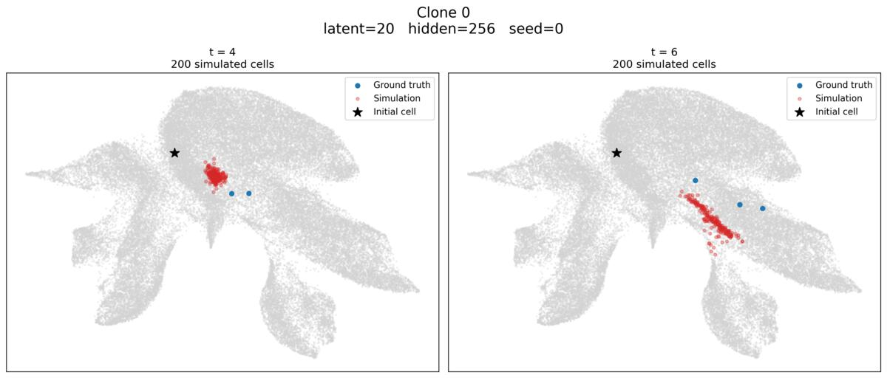
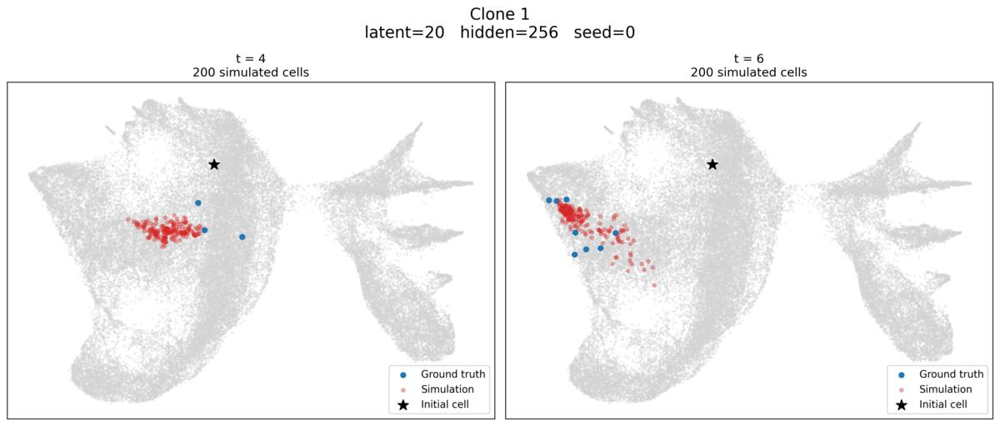
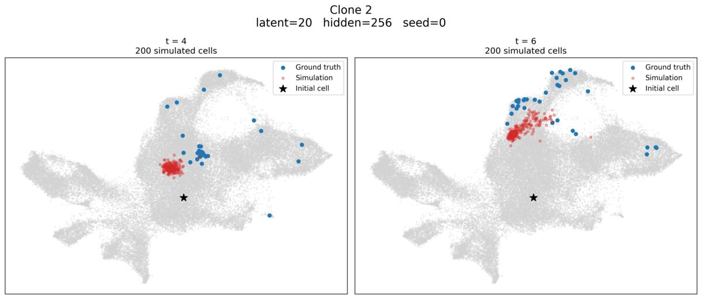
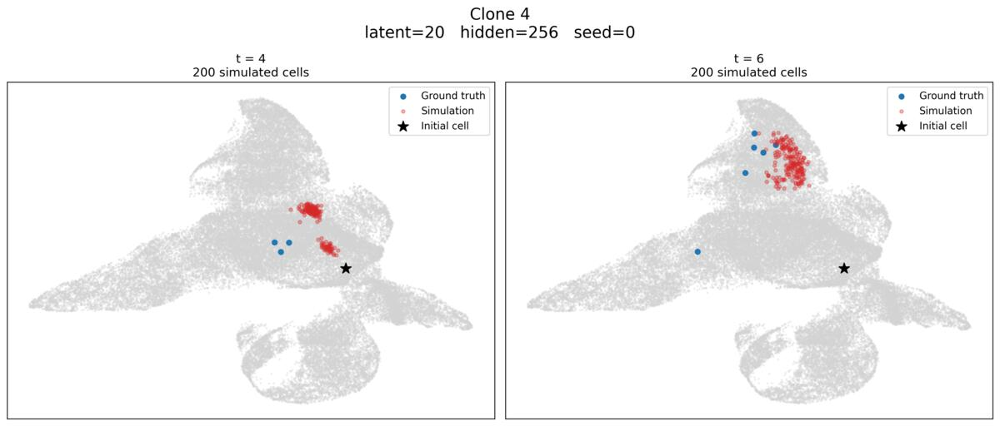

# A Latent Space Benchmark for Future Cell Prediction in Single-Cell RNA-seq

Benchmarking PCA, scVI, VELOVI and FlatVI latent representations for future cell-state prediction from single-cell RNA-seq using a neural stochastic differential equation framework.

---

<table align="center">
  <tr>
    <td></td>
    <td></td>
  </tr>
  <tr>
    <td></td>
    <td></td>
  </tr>
</table>

<figcaption align="center">
<em>Examples of cells generated by the neural SDE model in the four studied latent representations, visualized with UMAP. Gray points represent real cells encoded into the corresponding latent space. The star marker indicates the initial state of the selected clone at t<sub>2</sub>. Blue points represent the observed cells from the same clone at the target time point (t<sub>4</sub> or t<sub>6</sub>), while red points represent cells simulated by the neural SDE model from the initial clone state.</em>
</figcaption>

---

## Overview

Single-cell RNA sequencing (scRNA-seq) provides a high-dimensional and sparse representation of cellular states. Latent representations are commonly used to reduce this dimensionality while preserving biologically relevant information.

This project investigates whether the choice of latent representation affects the ability to model cellular dynamics and predict future cell states.

Four representations are benchmarked:

* **PCA**
* **scVI**
* **VELOVI**
* **FlatVI**

Future cell states are predicted using **scDiffEq**, a neural stochastic differential equation framework, and evaluated against experimentally observed populations using **optimal transport (OT)**.

### Main research question

> **Does the choice of latent representation affect future cell-state prediction from single-cell RNA-seq data?**

---

## Key results

The benchmark evaluates both reconstruction quality and future-state prediction.

* **scVI** achieves the lowest reconstruction error according to L2 and cosine distance.
* **PCA** achieves the lowest Hellinger-style reconstruction error.
* In latent space, **scVI** achieves the lowest normalized OT error at both prediction time points.
* In gene-expression space, **PCA and scVI generally outperform VELOVI and FlatVI**, although the results depend on the distance metric.
* The relationship between reconstruction quality and future-state prediction is positive across representation families, but is less consistent within individual methods.

These results suggest that **good reconstruction quality does not necessarily translate into uniformly better dynamical prediction**, and that the choice of evaluation space and metric can substantially affect the conclusions.

See the full report for the detailed results, statistical analysis and discussion.

---

## Full report

The complete scientific report provides the detailed methodology, preprocessing pipeline, benchmark configuration, full quantitative results, metric definitions, correlation analysis and discussion.

**[Read the full scientific report](pdf/scdiffeq_benchmark.pdf)**

---

## Approach

The benchmark follows three main steps:

### 1. Latent representation

Each cell is mapped to a latent representation using PCA, scVI, VELOVI or FlatVI.

Five latent dimensionalities are evaluated:

**10, 20, 50, 100 and 200 dimensions.**

### 2. Future-state prediction

A neural stochastic differential equation model from **scDiffEq** is trained in each latent space.

The model learns drift and diffusion functions and generates stochastic future trajectories from initial cell populations.

### 3. Evaluation

Predicted and experimentally observed cell populations are compared using **optimal transport**.

Evaluation is performed in:

* **latent space**, using the geometry of each representation;
* **gene-expression space**, after decoding predicted latent states.

Gene-expression predictions are compared using L2, cosine and Hellinger-style distances.

---

## Dataset

The benchmark uses the **LARRY lineage-tracing dataset**, which provides longitudinal lineage information for single cells.

The dataset contains approximately:

* **49,302 cells**
* **5,864 independent clones**
* **23,420 genes**
* *Mus musculus*
* **3 observed time points**

The lineage information makes it possible to compare predicted future cell states with experimentally observed descendants.

> **Dataset source:** [LARRY AnnData feature inclusive](https://figshare.com/articles/dataset/LARRY_AnnData_feature_inclusive_/29329532)

The dataset is split at the **clone level**, with 80% of clones used for training and 20% for validation of the scDiffEq benchmark.

The raw dataset is not redistributed in this repository.

---

## Experimental configuration

The benchmark evaluates:

* 4 latent representation methods
* 5 latent dimensions: 10, 20, 50, 100, 200
* 3 scDiffEq hidden dimensions: 64, 128, 256
* 3 independent random seeds

This results in **180 scDiffEq models**.

Additional methodological details, preprocessing choices and evaluation procedures are described in the full report.


---

## Installation

Clone the repository:

```bash
git clone https://github.com/Torzzy/scdiffeq_latent_representation_benchmark
cd scdiffeq_latent_representation_benchmark
```

Create a Python environment:

```bash
python -m venv .venv
source .venv/bin/activate
```

Install the required dependencies:

```bash
pip install -r requirements.txt
```

---

## Reproducibility

The main experiments can be reproduced using the provided scripts.

### Preprocessing

```bash
python -m script/preprocessing/run_preprocessing.py
```

### scDiffEq benchmark

```bash
python -m script/benchmark/run_benchmark.py
```

### Analysis

```bash
python -m scdiffeq/analysis/run_analysis.py
```

Random seeds are explicitly controlled for the scDiffEq experiments.

---

## Computational environment

The experiments were implemented in Python and relied primarily on:

* [PyTorch](https://pytorch.org/)
* [Scanpy](https://scanpy.scverse.org/)
* [scvi-tools](https://scvi-tools.org/)

Main environment:

```text
Python: 3.11
PyTorch: 2.13.0.dev20260517+cu132
scvi-tools: 1.4.2
Scanpy: 1.11.5
```

## Notes

This benchmark is intended as an exploratory study of how latent representations interact with neural dynamical models for single-cell data.

The conclusions depend on the dataset, representation models, scDiffEq configuration and evaluation metrics considered here. The full report discusses these limitations in detail.

For any questions, feel free to reach out:

* **GitHub:** [@Torzzy](https://github.com/Torzzy)
* **Email:** [tomdauve@gmail.com](mailto:tomdauve@gmail.com)
